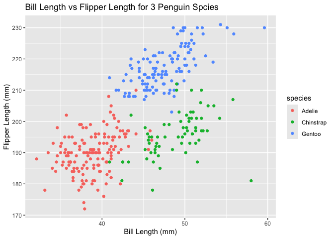

p8105_HW1_mh4589
================
2024-09-14

``` r
library (tidyverse)
```

## Problem 1

Load the penguins dataset.

``` r
data("penguins", package = "palmerpenguins")
```

#### Description of the dataset

Here are the variables of the penguins dataset:

**Species**: The species of the penguin (Adelie, Chinstrap, or Gentoo).

**Island**: The island where the penguin was observed (Biscoe, Dream, or
Torgersen).

**Bill_length_mm**: The length of the penguin’s bill in millimeters.

**Bill_depth_mm**: The depth of the penguin’s bill in millimeters.

**Flipper_length_mm**: The length of the penguin’s flipper in
millimeters.

**Body_mass_g**: The body mass of the penguin in grams.

**Sex**: The sex of the penguin (male or female)

The data set has 8 columns and 344 rows.

The mean flipper length is 200.9152047 milimeters.

    ## Warning: Removed 2 rows containing missing values or values outside the scale range
    ## (`geom_point()`).

<!-- -->

    ## Saving 7 x 5 in image

    ## Warning: Removed 2 rows containing missing values or values outside the scale range
    ## (`geom_point()`).

## Problem 2

``` r
#create a 10x4 data frame. Length is 10. 4 different vectors 
rnorm_df = 
  tibble (
    norm_samp = rnorm(10),
    vec_logical = norm_samp > 0,
    vec_character = c("Item 1", "Item 2", "Item 3", "Item 4", "Item 5", "Item 6", "Item 7", "Item 8", "Item 9", "Item 10"),
    vec_factor = factor(sample(c("level 1", "level 2", "level 3"), 10, replace = TRUE)))
  
print(rnorm_df)
```

    ## # A tibble: 10 × 4
    ##    norm_samp vec_logical vec_character vec_factor
    ##        <dbl> <lgl>       <chr>         <fct>     
    ##  1   -1.75   FALSE       Item 1        level 2   
    ##  2   -0.669  FALSE       Item 2        level 2   
    ##  3    0.245  TRUE        Item 3        level 3   
    ##  4    0.653  TRUE        Item 4        level 2   
    ##  5   -0.204  FALSE       Item 5        level 1   
    ##  6    0.425  TRUE        Item 6        level 3   
    ##  7    0.813  TRUE        Item 7        level 3   
    ##  8   -0.675  FALSE       Item 8        level 1   
    ##  9   -2.23   FALSE       Item 9        level 3   
    ## 10    0.0114 TRUE        Item 10       level 2
